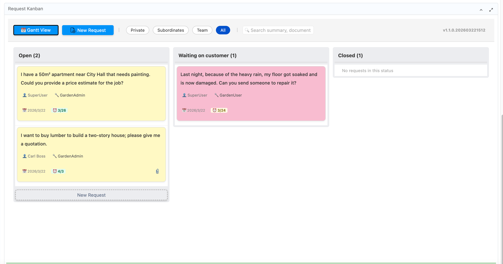
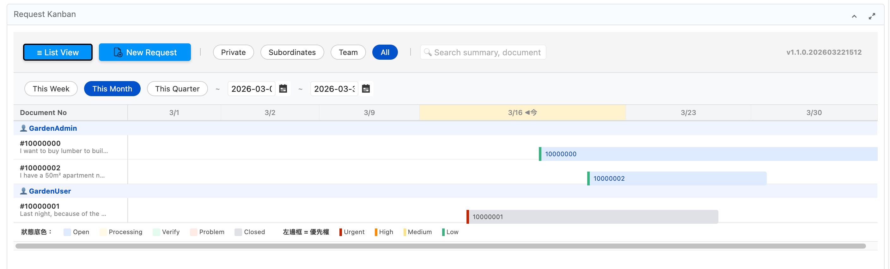
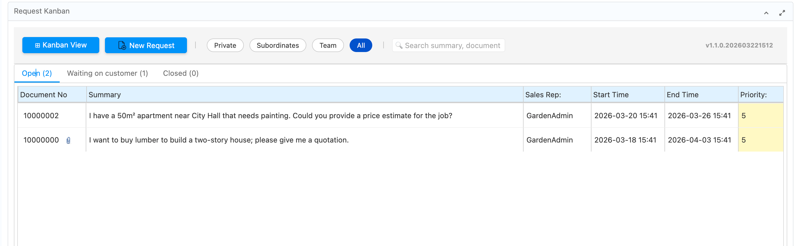
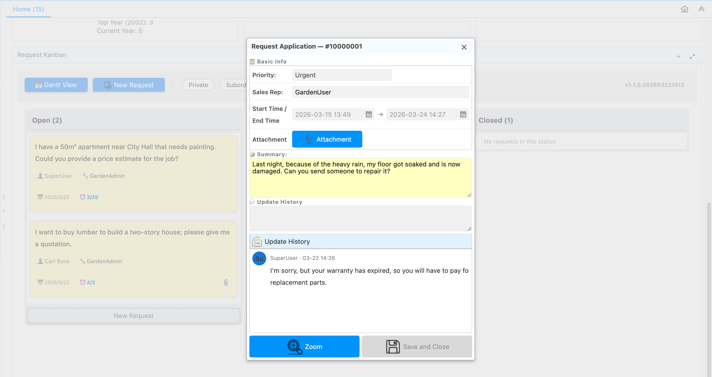
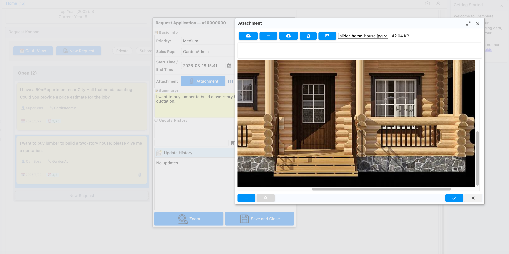

# tw.idempiere.requestkanban
### The Request Kanban Dashboard — iDempiere's Missing Middle Child

---

## 🌐 English

> *In the beginning, there was iDempiere. And iDempiere had requests. Many, many requests. And lo, the people cried out: "Where did ticket #1002208 go?" And no one knew.*
>
> *Thus was born the Request Kanban Dashboard — so that no request shall be lost, no status unknown, and no manager shall ever again ask "what are you working on?" without first checking the board.*

---

## 📸 Screenshots

| Kanban View | Gantt View |
|:-----------:|:----------:|
|  |  |

| List View | Update History |
|:---------:|:--------------:|
|  |  |

---

### ✨ What Is This Thing

`tw.idempiere.requestkanban` is an OSGi plugin for iDempiere 12 that replaces the ancient art of "searching the R_Request window and hoping for the best" with three glorious view modes, real-time updates, and a Gantt chart that even your PM will understand.

No new database tables. No new columns. We are guests in iDempiere's house and we wipe our feet at the door.

---

### 🚀 Features

#### Three Views, One Dashboard, Zero Excuses

**⊞ Kanban View** *(the one with the pretty cards)*
- Requests live as draggable cards, grouped by status column.
- Color-coded by priority: Urgent (pink) / High (orange) / Medium (yellow) / Low (green). If everything is pink, that is a you problem, not a plugin problem.
- Due date chips: 🔴 Overdue / ⏰ Due soon / ✅ Plenty of time (enjoy it while it lasts).
- Drag-and-drop to change status. Only the SalesRep or Requester can move cards — because democracy has limits.
- Status column icons: upload an image to the R_Status record as an attachment, and it becomes the column icon. If you don't, it falls back to the Help field. If that's also empty, you get nothing. You had one job.

**📅 Gantt View** *(the one that makes you feel organized)*
- Timeline chart with requests as colored bars. Finally, a reason to hold a meeting that could have been an email.
- Time range pills: This Week / This Month / This Quarter. Custom date range also available for the ambitious.
- Auto-granularity: day columns for short ranges, week columns for medium, month columns for "we are very behind."
- Today's column is highlighted yellow, a gentle reminder that time is passing.
- Bars are color-coded by status (background) and priority (left border). Visual information density: maximum. Excuses: none.
- Requests with no start/end date appear as greyed-out rows labelled "No date set." They are not forgotten. They are merely... pending.
- In Team/All scope, rows are grouped under responsible person headers — so everyone knows exactly who owns what.
- Click any bar to open the Request Update dialog. It works. We were surprised too.

**≡ List View** *(the one for people who distrust fun)*
- Tabbed list grouped by status. Columns. Rows. Data. Very professional. Very beige.

#### Always-On Features
- **Scope Filter**: Personal / Subordinates / Team / All — applies to all three views. Choose wisely. "All" may be overwhelming.
- **Search**: Filter by summary or document number. Faster than scrolling. We timed it.
- **Real-time Updates**: Powered by OSGi EventAdmin. When someone updates a request, every connected browser refreshes automatically. No F5. No polling. Pure event-driven elegance.
- **Update Dialog**: Three-section layout — Basic Info / Summary / Update History with avatar initials. The avatar initials are computed from your name. If your initials spell something unfortunate, that is between you and HR.
- **Permission Control**: Only SalesRep or Requester can edit or move cards. Accountability, enforced.
- **Zoom to Window**: Jump straight to the iDempiere Request window for power users who demand the full experience.
- **Internationalization**: English and Traditional Chinese (zh_TW). More languages welcome via pull request.
- **Version Display**: Plugin version shown in the top-right corner. Currently `1.1.0`. We are proud of this number.

---

### 🛠️ Technical Notes

| Thing | Detail |
|-------|--------|
| Entry point | `/zul/request-kanban.zul` |
| Main class | `tw.idempiere.requestkanban.dashboard.RequestKanbanDashboard` |
| New DB tables | 0 (zero, none, nada, 無) |
| New DB columns | 0 |
| iDempiere version | 12 |
| Build system | Eclipse PDE (Maven will lie to you; do not trust Maven here) |

**Status Icon Resolution** — `getStatusIconImage(MStatus)`: checks `MAttachment` on the R_Status record first. If an image file is found (png/jpg/jpeg/gif/webp), it is loaded as a ZK `AImage` and rendered at 16×16. Falls back to the `Help` field path. Falls back to nothing. Priority: attachment > Help field > void.

**Gantt Rendering** — `buildGanttHtmlFromFirstRow(ResultSet)`: pure server-side HTML string injected via ZK `Html`. Bar positions are percentage-based (`leftPct`, `widthPct`) relative to the date range. A JS bridge (`window._zkGanttClick`) routes bar clicks through ZK's async event system to the server. Yes, this is a Gantt chart built entirely with HTML table cells and `position:absolute`. Yes, it works. No, we are not sorry.

---

### ⚙️ Installation

1. **i18n**: Run `migration/i18n_setup.sql` in your database, OR use **Pack In** to import `META-INF/2Pack/RK_Messages.xml`. Do this first. The plugin will technically work without it, but everything will say `RK_SomethingUntranslated` and you will be sad.
2. **Compile**: Use Eclipse PDE to build the OSGi bundle JAR. (Again: not Maven. We're serious.)
3. **Deploy**: Drop the JAR into iDempiere. You know the drill.
4. **Start**: Confirm `tw.idempiere.requestkanban` is active.
5. **Dashboard Content**: Create a new entry with ZUL URL `/zul/request-kanban.zul` and link it to a menu item. Name it `@RK_RequestKanban@` for auto-translation.

**Optional — Custom Status Icons**: Open the R_Status window, find your status record, right-click → Attachment → upload a PNG. On next page load, that image becomes the column icon. It's that simple. You're welcome.

---

---

### 📋 History

#### 2026-03-25
- **Scrollbar fix** — Kanban columns, List tabpanels, and Gantt panel now scroll vertically when there are too many tasks. Previously the panel just grew forever with no scrollbar, which is not a feature, it is a cry for help.
- **Gantt left list is clickable** — Clicking a row in the task list on the left side of the Gantt view now opens the Request Update dialog. Previously only the bar was clickable. The rows were jealous.
- **Bugfix: date range picker crash** — Selecting a custom date range threw `java.lang.UnsupportedOperationException` because `java.sql.Date.toInstant()` is not supported by the JDK. Fixed by detecting `java.sql.Date` and calling `.toLocalDate()` directly.
- **Gantt bar label** — The bar no longer shows the Document Number. It now shows `(Applicant) Start~End` (e.g., `(王育偉) 3/1~3/31`), where Applicant is the AD_User_ID (requester), not the SalesRep. DocNo and Summary are still visible in the tooltip on hover.

---

### 🤝 Contributing

Found a bug? Open an issue.
Have an idea? Open a PR.
Want to say thank you? A ⭐ on GitHub is the garlic bread of open source — not required, but deeply appreciated.

### 📜 License
GPL. Share and share alike.

---
---

## 🌐 中文版

> **太史公曰：** 自古請求如恆河之沙，數之不盡，管之不易。或藏於資料庫深處，或迷失於 Window 介面之汪洋，負責人曰「我不知道」，主管曰「怎麼又卡住了」，申請人曰「我上週就填了啊」。三者相望於江湖，皆不得要領。
>
> 於是乎，看板降世。從此，請求有所歸，狀態有所顯，每週站會終於可以在十分鐘內結束。此誠 ERP 管理之一大德政也。

---

### ✨ 這是什麼

`tw.idempiere.requestkanban` 是一個 iDempiere 12 的 OSGi 外掛，將「打開 R_Request 視窗然後祈禱」這門傳統藝術，升華為三種視圖模式、即時更新、以及一張連 PM 都看得懂的甘特圖。

無新增資料表。無新增欄位。吾等乃 iDempiere 之座上賓，入門必擦鞋底。

---

### 🚀 功能特色

#### 三種視圖，一個儀表板，零藉口

**⊞ 看板視圖** *（有漂亮卡片的那個）*
- 請求以可拖曳卡片形式呈現，依狀態分欄。
- 優先權顏色編碼：緊急（粉紅）/ 高（橘）/ 中（黃）/ 低（綠）。若滿版皆粉紅，此乃業務問題，非外掛問題，請洽主管。
- 到期日標籤：🔴 逾期（此時應感到羞愧）/ ⏰ 快到了（請加速）/ ✅ 還早（好好珍惜）。
- 拖放換狀態，僅限 SalesRep 或申請人可操作。民主有其邊界，請求狀態亦然。
- 狀態欄 Icon：在 R_Status 記錄上傳附件圖檔，即成為欄標題 Icon。若未上傳，退回 Help 欄位。若 Help 也空白，那就什麼都沒有。你有機會的，你放棄了。

**📅 甘特圖視圖** *（讓你覺得自己很有規劃的那個）*
- 時間軸圖表，請求以彩色長條呈現。終於有理由開一個「其實是 Email 就能解決的會議」了。
- 時間範圍 Pill：本週 / 本月 / 本季。亦支援自訂區間，供有遠見或有苦衷者使用。
- 自動粒度：短區間顯示每日、中區間顯示每週一、長區間顯示「我們進度落後很多」的月份視圖。
- 今日所在欄以黃色標示，溫柔提醒時光流逝，此乃程式碼之禪意。
- 長條底色 = 狀態，左邊框色 = 優先權。資訊密度：最高。藉口空間：最小。
- 無起訖時間的請求以灰色列顯示，標記「未設定時間」。它們未被遺忘，只是⋯⋯還沒開始。
- 部屬/團隊/全部範圍下，依負責人自動分組顯示，讓每個人都清楚知道誰欠誰一個交代。
- 點擊長條即開啟請求更新對話框。此功能有效，我們自己也很驚喜。

**≡ 列表視圖** *（給不相信趣味的人）*
- 依狀態分頁的表格。欄、列、資料。非常專業。非常米色。

#### 常駐功能
- **範圍篩選**：個人 / 部屬 / 團隊 / 全部，三種視圖通用。「全部」可能令人崩潰，請自行評估。
- **搜尋**：依摘要或單號篩選。比滾輪快。我們計時過了。
- **即時更新**：由 OSGi EventAdmin 驅動。有人更新請求，所有連線瀏覽器自動重整，無需 F5，無需輪詢，純事件驅動之美學。
- **更新對話框**：三段式佈局——基本資訊 / 摘要 / 更新歷程（含頭像縮寫）。頭像縮寫由姓名計算而來；若縮寫組合不雅，此乃命名問題，請洽父母。
- **權限控制**：僅 SalesRep 或申請人可編輯與移動卡片。責任制，強制執行。
- **縮放視窗**：一鍵跳至 iDempiere 標準請求視窗，供需要完整體驗的進階使用者。
- **多國語系**：英文與繁體中文（zh_TW）。其他語言歡迎送 PR，我們很感動但不會主動翻譯。
- **版本顯示**：儀表板右上角顯示外掛版本。目前為 `1.1.0`，我們對此數字感到自豪。

---

### 🛠️ 技術細節

| 項目 | 說明 |
|------|------|
| 啟動 ZUL | `/zul/request-kanban.zul` |
| 主控類別 | `tw.idempiere.requestkanban.dashboard.RequestKanbanDashboard` |
| 新增資料表 | 0（零，没有，無，None） |
| 新增欄位 | 0 |
| iDempiere 版本 | 12 |
| 建置工具 | Eclipse PDE（Maven 會騙你，請不要相信 Maven） |

**狀態 Icon 解析邏輯** — `getStatusIconImage(MStatus)`：先查 R_Status 的 `MAttachment`；找到圖檔（png/jpg/jpeg/gif/webp）則載入為 ZK `AImage`，以 16×16 顯示。無附件則退回 `Help` 欄位路徑。再無則為空。優先順序：附件 > Help 欄位 > 虛無。

**甘特圖渲染** — `buildGanttHtmlFromFirstRow(ResultSet)`：純伺服器端 HTML 字串，透過 ZK `Html` 元件注入。長條位置以百分比計算（`leftPct`、`widthPct`）。JS Bridge（`window._zkGanttClick`）將長條點擊事件路由回 ZK 伺服器端。是的，這是一張以 HTML table 格子與 `position:absolute` 打造的甘特圖。是的，它可以運作。不，我們不後悔。

---

### ⚙️ 安裝步驟

1. **多國語系**：先執行 `migration/i18n_setup.sql`，或用 **Pack In** 匯入 `META-INF/2Pack/RK_Messages.xml`。請先做這步。不做也不會爆炸，但畫面上會出現一堆 `RK_SomethingUntranslated`，你會難受的。
2. **編譯**：使用 Eclipse PDE 建置 OSGi Bundle JAR。（再說一次：不是 Maven。我們是認真的。）
3. **部署**：將 JAR 部署至 iDempiere。這你熟。
4. **啟動**：確認 `tw.idempiere.requestkanban` Bundle 已啟動。
5. **儀表板內容**：新增一筆儀表板內容，ZUL URL 填 `/zul/request-kanban.zul`，連結至選單項目，名稱填 `@RK_RequestKanban@` 以自動翻譯。

**選用：自訂狀態 Icon** — 開啟 Request Status 視窗，找到目標狀態記錄，按右鍵 → Attachment → 上傳圖檔。下次頁面載入即生效。就這樣。我們知道你以為會更複雜。

---

---

### 📋 更新記錄

#### 2026-03-25
- **捲軸修正** — 看板欄、列表分頁與甘特面板，在任務過多時現在會正確顯示垂直捲軸。先前面板只會無限往下長，這不是功能，這是求救訊號。
- **甘特圖左側清單可點擊** — 點擊甘特圖左側任務清單的任一列，現在會開啟請求更新對話框。先前只有右側長條可以點。那些列一直默默地羨慕著。
- **修正：日期區間選擇器崩潰** — 選擇自訂日期區間時會拋出 `java.lang.UnsupportedOperationException`，因為 JDK 的 `java.sql.Date.toInstant()` 方法根本不被支援。修正方式：偵測到 `java.sql.Date` 時直接呼叫 `.toLocalDate()`。
- **甘特長條標籤** — 長條不再顯示單號，改為顯示 `（申請人）起始~結束`（例如：`(王育偉) 3/1~3/31`），申請人為 AD_User_ID（非負責人 SalesRep）。滑鼠移上去的 tooltip 仍會顯示單號與摘要。

---

### 🤝 貢獻方式

發現 Bug？開 Issue。
有好點子？送 PR。
想說謝謝？給顆 ⭐ 吧 —— 大蒜麵包不是正餐，但有它人生更美好。

### 📜 授權
本專案採用 GPL 授權。分享即美德。
